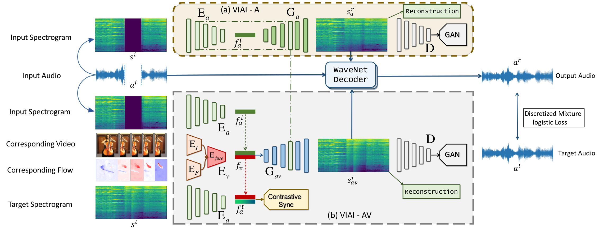

# Vision-Infused Audio Inpainter (VIAI)

这是对论文 **Vision-Infused Deep Audio Inpainting** 的复现工程。当前工程已经补齐从数据准备、Mel-spectrogram 修复训练/测试，到可选 Griffin-Lim vocoder 导出 wav 的主流程。

原论文与项目页面：

- [Project](https://hangz-nju-cuhk.github.io/projects/AudioInpainting)
- [Paper](https://arxiv.org/abs/1910.10997)
- [Demo](https://www.youtube.com/watch?v=2C8s_YuRRxk)



## 1. 当前支持的阶段

| 阶段 | 入口 | 说明 |
| --- | --- | --- |
| VIAI-A | `train-viai-a` / `test-viai-a` | Audio-only Mel inpainting baseline |
| VIAI-A + PatchGAN | `train-viai-a --use_gan` | 在 VIAI-A 上加入 Mel PatchGAN |
| VIAI-AV | `train-viai-av` / `test-viai-av` | 加入 RGB + optical flow 视频分支 |
| VIAI-AV + sync/probe | `train-viai-av` 默认启用 | 加入 audio-video sync loss 和 VIAI-AA' probe branch，不使用 PatchGAN |
| VIAI-AV + PatchGAN | `train-viai-av --use_gan` | 在 VIAI-AV 上加入 Mel PatchGAN |
| Vocoder 输出 | 测试时加 `--use_vocoder` | 使用 Griffin-Lim 将修复 Mel 导出为 wav |

说明：第五阶段使用 Griffin-Lim，不需要训练 WaveNet，也不需要下载 HiFi-GAN/WaveGlow 预训练模型。它适合快速跑通端到端 demo，音质不等价于论文完整 WaveNet 设置。

## 2. 环境准备

推荐 Python 3.10。CUDA 版 PyTorch 建议按目标机器单独安装，避免被普通依赖覆盖。

本地 CPU / 已有环境：

```bash
python -m pip install --upgrade pip
python -m pip install imageio-ffmpeg librosa nnmnkwii opencv-contrib-python pillow scikit-image tensorboard tensorboardX tqdm "yt-dlp[default]"
```

云端 CUDA 环境示例：

```bash
python -m pip install --upgrade pip
python -m pip install imageio-ffmpeg librosa nnmnkwii "numpy==1.22.4" opencv-contrib-python-headless pillow scikit-image tensorboard tensorboardX tqdm "yt-dlp[default]"
python -c "import torch, cv2; print(torch.__version__, torch.cuda.is_available(), cv2.__version__)"
```

确认 TV-L1 optical flow 可用：

```bash
python -c "import cv2; print(hasattr(cv2, 'optflow') or hasattr(cv2, 'DualTVL1OpticalFlow_create'))"
```

统一设置数据目录：

```bash
export DATA_ROOT=/root/shared-nvme/data
```

本地小规模调试可以直接使用仓库内 `data/`：

```bash
export DATA_ROOT=data
```

## 3. 数据准备

### 3.1 下载 MUSICES 视频

```bash
python main.py prepare-data -- download \
  --json "$DATA_ROOT/MUSICES.json" \
  --data-root "$DATA_ROOT" \
  --skip-existing
```

如果 YouTube 需要 cookies：

```bash
python main.py prepare-data -- download \
  --json "$DATA_ROOT/MUSICES.json" \
  --data-root "$DATA_ROOT" \
  --skip-existing \
  --yt-dlp-extra-arg=--cookies \
  --yt-dlp-extra-arg=/absolute/path/to/youtube_cookies.txt
```

视频目录约定：

```text
$DATA_ROOT/raw_videos/<instrument>/<youtube_id>.mp4
```

### 3.2 生成 VIAI-A audio-only 样本

只抽取 16kHz mono audio、`raw_audio.npy` 和 `mel.npy`：

```bash
python main.py prepare-viai-a -- \
  --json "$DATA_ROOT/MUSICES.json" \
  --data-root "$DATA_ROOT" \
  --processed-dir processed_viai_a \
  --skip-existing
```

输出：

```text
$DATA_ROOT/processed_viai_a/<instrument>/<youtube_id>/source.wav
$DATA_ROOT/processed_viai_a/<instrument>/<youtube_id>/raw_audio.npy
$DATA_ROOT/processed_viai_a/<instrument>/<youtube_id>/mel.npy
```

生成 audio-only split：

```bash
python main.py split-data -- \
  --data-root "$DATA_ROOT" \
  --processed-dir processed_viai_a \
  --train-split-name train_viai_a_split.txt \
  --val-split-name val_viai_a_split.txt \
  --test-split-name test_viai_a_split.txt \
  --audio-only
wc -l "$DATA_ROOT/train_viai_a_split.txt" "$DATA_ROOT/val_viai_a_split.txt" "$DATA_ROOT/test_viai_a_split.txt"
head -n 3 "$DATA_ROOT/train_viai_a_split.txt"
```

后续 VIAI-A 训练/测试读取的是上述 split 文件中的相对路径，因此样本实际位于
`$DATA_ROOT/processed_viai_a/...`，不再使用默认的 `$DATA_ROOT/processed/...`。
如果之前生成过旧 split，需要重新运行上面的 `split-data` 命令覆盖它；`head` 输出的
第一列应以 `processed_viai_a/` 开头，不能是 `processed/`。

### 3.3 生成 VIAI-AV 样本

生成 4 秒 clip、50 帧 RGB、50 帧 optical flow、对应 Mel/audio：

```bash
python main.py prepare-data -- process \
  --json "$DATA_ROOT/MUSICES.json" \
  --data-root "$DATA_ROOT" \
  --skip-existing \
  --max-clips-per-video 5
```

正式复现建议保留默认 TV-L1；只做链路 smoke test 时，可临时加 `--flow-method farneback` 提速。

生成 AV split：

```bash
python main.py split-data -- \
  --data-root "$DATA_ROOT" \
  --train-split-name train_av_split.txt \
  --val-split-name val_av_split.txt \
  --test-split-name test_av_split.txt
wc -l "$DATA_ROOT/train_av_split.txt" "$DATA_ROOT/val_av_split.txt" "$DATA_ROOT/test_av_split.txt"
```

AV 样本需包含：

```text
raw_audio.npy
mel.npy
image_crop/
flow_x_crop/
flow_y_crop/
```

不合格样本会被跳过，并记录到：

```text
$DATA_ROOT/viai_av_bad_samples.csv
$DATA_ROOT/musices_process_failures.csv
```

## 4. 训练与测试

### 4.1 VIAI-A baseline

以下命令默认读取 `train_viai_a_split.txt`、`val_viai_a_split.txt` 和
`test_viai_a_split.txt`，这些 split 需由 3.2 中带 `--processed-dir processed_viai_a`
的命令重新生成，确保文件里的样本路径指向 `processed_viai_a/...`。

1 step sanity check：

```bash
python main.py train-viai-a -- \
  --data_root "$DATA_ROOT" \
  --train_split_name train_viai_a_split.txt \
  --val_split_name val_viai_a_split.txt \
  --batch_size 1 \
  --num_workers 0 \
  --max_train_steps 1 \
  --display_id 0
```

正式训练：

```bash
python main.py train-viai-a -- \
  --data_root "$DATA_ROOT" \
  --train_split_name train_viai_a_split.txt \
  --val_split_name val_viai_a_split.txt \
  --batch_size 16 \
  --num_workers 4 \
  --checkpoint_interval 1000 \
  --print_freq 100 \
  --display_id 0 \
  --log_event_path checkpoints/viai_a_checkpoints 
```

测试：

```bash
python main.py test-viai-a -- \
  --data_root "$DATA_ROOT" \
  --test_split_name test_viai_a_split.txt \
  --resume_path checkpoints/VIAI-A_checkpoint_step000006000.pth.tar \
  --batch_size 16 \
  --num_workers 4 \
  --display_id 0 \
  --results_dir checkpoints/viai_a_test_results
```

输出：

```text
checkpoints/VIAI-A_checkpoint_step*.pth.tar
checkpoints/viai_a_test_results/VIAI-A_stepXXXXXXXXX_test.json
checkpoints/viai_a_test_results/VIAI-A_test_summary.csv
checkpoints/viai_a_test_results/mel-image/stepXXXXXXXXX/*.png
```

### 4.2 VIAI-A + PatchGAN

从 VIAI-A checkpoint 初始化权重并开启一个新的 PatchGAN 实验。`--init_from_viai_a`
只加载模型权重，不继承 `global_step`、`global_epoch` 或 optimizer；TensorBoard
横轴会从 0 开始。若要继续同一个训练 run，才使用 `--resume`。

```bash
python main.py train-viai-a -- \  --use_gan   --name VIAI-A-PatchGAN   --data_root "$DATA_ROOT"   --train_split_name train_viai_a_split.txt   --val_split_name val_viai_a_split.txt     --batch_size 16   --num_workers 4   --beta_recon 1.0   --checkpoint_interval 1000   --print_freq 100   --display_id 0 --lambda_gan 0.001 --log_event_path checkpoints/viai-a_patchfromscratch
```

测试 PatchGAN checkpoint 时也传 `--use_gan`：

```bash
python main.py test-viai-a -- \
  --use_gan \
  --name VIAI-A-PatchGAN \
  --data_root "$DATA_ROOT" \
  --test_split_name test_viai_a_split.txt \
  --resume_path checkpoints/viai-a_patchfromscratch/VIAI-A-PatchGAN_checkpoint_step000002000.pth.tar \
  --batch_size 16 \
  --num_workers 4 \
  --display_id 0 \
  --results_dir checkpoints/viai_a_patchgan_test_results
```

### 4.3 VIAI-AV

VIAI-AV 默认不使用 PatchGAN，用作带视频分支、sync/probe loss 的 baseline，并优先从
`VIAI-A` checkpoint 初始化音频侧权重。若要启用 PatchGAN，需要显式传 `--use_gan`。

1 step sanity check：

```bash
python main.py train-viai-av -- \
  --data_root "$DATA_ROOT" \
  --train_split_name train_av_split.txt \
  --val_split_name val_av_split.txt \
  --init_from_viai_a checkpoints/VIAI-A_checkpoint_step000006800.pth.tar \
  --checkpoint_dir /tmp/viai_av_smoke \
  --log_event_path /tmp/viai_av_smoke/events \
  --batch_size 1 \
  --num_workers 0 \
  --max_train_steps 1 \
  --display_id 0 \
  --print_freq 1
```

正式训练：

```bash
python main.py train-viai-av -- \
  --data_root "$DATA_ROOT" \
  --train_split_name train_av_split.txt \
  --val_split_name val_av_split.txt \
  --init_from_viai_a checkpoints/VIAI-A_checkpoint_step000006800.pth.tar \
  --batch_size 16 \
  --num_workers 4 \
  --lambda_recon 1.0 \
  --checkpoint_interval 1000 \
  --print_freq 100 \
  --display_id 0
  --log_event_path checkpoints/viai_av_events
```

继续训练：

```bash
python main.py train-viai-av -- \
  --resume \
  --resume_path checkpoints/VIAI-AV_checkpoint_step000001000.pth.tar \
  --data_root "$DATA_ROOT" \
  --train_split_name train_av_split.txt \
  --val_split_name val_av_split.txt \
  --batch_size 16 \
  --num_workers 4 \
  --display_id 0
  --log_event_path checkpoints/viai_av_events
```

测试：

```bash
python main.py test-viai-av -- \
  --resume_path checkpoints/viai_av_checkpoints/VIAI-AV_checkpoint_step000001000.pth.tar \
  --data_root "$DATA_ROOT" \
  --test_split_name test_av_split.txt \
  --batch_size 16 \
  --num_workers 4 \
  --display_id 0 \
  --results_dir checkpoints/viai_av_test_results
```

### 4.4 VIAI-AV + PatchGAN

启用 PatchGAN 时传 `--use_gan`。默认名称会变为 `VIAI-AV-PatchGAN`，日志目录为
`events_viai_av_patchgan`；若未显式传 `--init_from_viai_a`，会优先寻找
`VIAI-A-PatchGAN` checkpoint，找不到再回退到 `VIAI-A` checkpoint。

```bash
python main.py train-viai-av -- \
  --use_gan \
  --data_root "$DATA_ROOT" \
  --train_split_name train_av_split.txt \
  --val_split_name val_av_split.txt \
  --init_from_viai_a checkpoints/VIAI-A-PatchGAN_checkpoint_step000006800.pth.tar \
  --batch_size 8 \
  --num_workers 4 \
  --lambda_recon 1.0 \
  --lambda_gan 0.001 \
  --checkpoint_interval 1000 \
  --print_freq 100 \
  --display_id 0 \
  --log_dir checkpoints/viai-av-patchgan_checkpoints \
```

测试 PatchGAN checkpoint 时也传 `--use_gan`：

```bash
python main.py test-viai-av -- \
  --use_gan \
  --resume_path checkpoints/VIAI-AV-PatchGAN_checkpoint_step000001000.pth.tar \
  --data_root "$DATA_ROOT" \
  --test_split_name test_av_split.txt \
  --batch_size 16 \
  --num_workers 4 \
  --display_id 0 \
  --results_dir checkpoints/viai_av_patchgan_test_results
```

如果本地 `test_av_split.txt` 为空，可以临时用训练 split 验证入口：

```bash
python main.py test-viai-av -- \
  --resume_path /tmp/viai_av_smoke/VIAI-AV_checkpoint_step000000001.pth.tar \
  --data_root "$DATA_ROOT" \
  --test_split_name train_av_split.txt \
  --batch_size 1 \
  --num_workers 0 \
  --display_id 0 \
  --results_dir /tmp/viai_av_smoke_results
```

输出：

```text
checkpoints/VIAI-AV_checkpoint_step*.pth.tar
checkpoints/viai_av_test_results/VIAI-AV_stepXXXXXXXXX_test.json
checkpoints/viai_av_test_results/VIAI-AV_test_summary.csv
checkpoints/viai_av_test_results/mel-image/stepXXXXXXXXX/*.png
```

### 4.5 Sync/probe ablation

第四阶段的 sync loss 和 probe loss 在 `train-viai-av` 中默认启用。需要退回第三阶段式损失时关闭：

```bash
python main.py train-viai-av -- \
  --data_root "$DATA_ROOT" \
  --train_split_name train_av_split.txt \
  --val_split_name val_av_split.txt \
  --init_from_viai_a checkpoints/VIAI-A-PatchGAN_checkpoint_step000002000.pth.tar \
  --disable_sync_loss \
  --disable_probe_loss
```

### 4.6 可选 vocoder 导出 wav

测试时传 `--use_vocoder`，将修复后的 Mel 导出为 wav：

```bash
python main.py test-viai-av -- \
  --resume_path checkpoints/VIAI-AV_checkpoint_step000001000.pth.tar \
  --data_root "$DATA_ROOT" \
  --test_split_name test_av_split.txt \
  --batch_size 16 \
  --num_workers 4 \
  --display_id 0 \
  --results_dir checkpoints/viai_av_test_results \
  --use_vocoder \
  --vocoder_n_iter 32
```

调试时可限制只生成 1 个样本：

```bash
python main.py test-viai-av -- \
  --resume_path /tmp/viai_av_smoke/VIAI-AV_checkpoint_step000000001.pth.tar \
  --data_root "$DATA_ROOT" \
  --test_split_name train_av_split.txt \
  --batch_size 1 \
  --num_workers 0 \
  --results_dir /tmp/viai_av_smoke_results \
  --use_vocoder \
  --vocoder_max_samples 1 \
  --vocoder_n_iter 1
```

输出：

```text
<results_dir>/wav/stepXXXXXXXXX/*_reconstructed.wav
<results_dir>/wav/stepXXXXXXXXX/*_target.wav
```

## 5. 指标与结果查看

测试 JSON/CSV 主要字段：

```text
mel_l1_full
mel_l1_missing
psnr_full
psnr_missing
ssim
loss_recon / loss_g_gan / loss_sync / loss_probe_gen
lambda_recon
retrieval_audio_to_video_r1
retrieval_video_to_audio_r1
```

Mel 对比图位于：

```text
<results_dir>/mel-image/stepXXXXXXXXX/*.png
```

TensorBoard：

```bash
tensorboard --logdir checkpoints/events_viai_a --port 6006
tensorboard --logdir checkpoints/events_viai_a_patchgan --port 6006
tensorboard --logdir checkpoints/events_viai_av --port 6006
tensorboard --logdir checkpoints/events_viai_av_patchgan --port 6006
```

VIAI-A/VIAI-AV TensorBoard 额外写入 `weighted_loss_recon` 和
`weighted_loss_gan`，用于查看各 loss 项对总损失的实际贡献。

## 6. 常见问题

OpenCV 无法读取 mp4：

```bash
python - <<'PY'
import cv2
print(cv2.__version__, cv2.__file__)
for line in cv2.getBuildInformation().splitlines():
    if "FFMPEG" in line or "GStreamer" in line:
        print(line)
PY
```

如果 `FFMPEG: NO`，建议重新安装 headless contrib 版本：

```bash
python -m pip uninstall -y opencv-python opencv-python-headless opencv-contrib-python opencv-contrib-python-headless
python -m pip install --no-cache-dir "opencv-contrib-python-headless==4.10.0.84"
```

数据 split 为空：

- Audio-only：确认样本目录里有 `raw_audio.npy` 和 `mel.npy`。
- AV：确认样本目录里有 `raw_audio.npy`、`mel.npy`、`image_crop/`、`flow_x_crop/`、`flow_y_crop/`。
- 查看 `$DATA_ROOT/viai_av_bad_samples.csv` 和 `$DATA_ROOT/musices_process_failures.csv`。

显存不足：

- 先降低 `--batch_size`。
- smoke test 用 `--batch_size 1 --num_workers 0 --max_train_steps 1`。

## 7. 代码入口速查

```text
main.py                         # 统一命令入口
tools/prepare_viai_a.py          # audio-only 数据准备
tools/prepare_musices.py         # AV 数据准备、抽帧、光流、Mel
tools/split_musices.py           # split 生成
train_viai_a.py / test_viai_a.py # VIAI-A 训练测试
train_viai_av.py / test_viai_av.py
Models/                          # 模型封装
networks/                        # encoder / decoder / discriminator
utils/vocoder.py                 # Griffin-Lim wav 导出
logmd/MODIFICATION_LOG.md        # 详细改动记录
logmd/information.md             # 复现路线说明
```

## License and Citation

The use of this software is RESTRICTED to **non-commercial research and educational purposes**.

```bibtex
@InProceedings{Zhou_2019_ICCV,
  author = {Zhou, Hang and Liu, Ziwei and Xu, Xudong and Luo, Ping and Wang, Xiaogang},
  title = {Vision-Infused Deep Audio Inpainting},
  booktitle = {The IEEE International Conference on Computer Vision (ICCV)},
  month = {October},
  year = {2019}
}
```

## Acknowledgement

The structure of this codebase is borrowed from [pix2pix](https://github.com/junyanz/pytorch-CycleGAN-and-pix2pix) and [wavenet_vocoder](https://github.com/r9y9/wavenet_vocoder).
