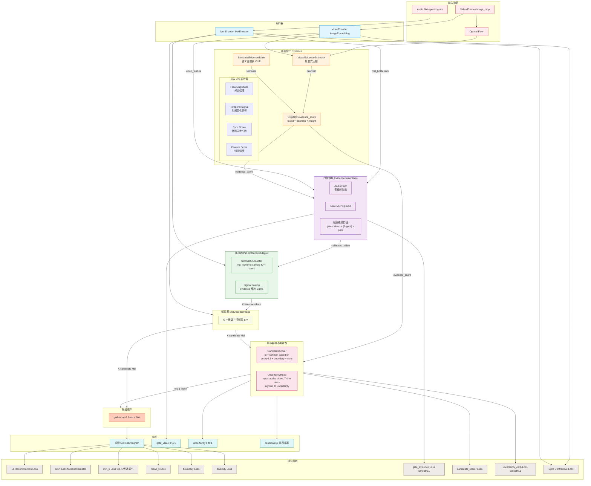
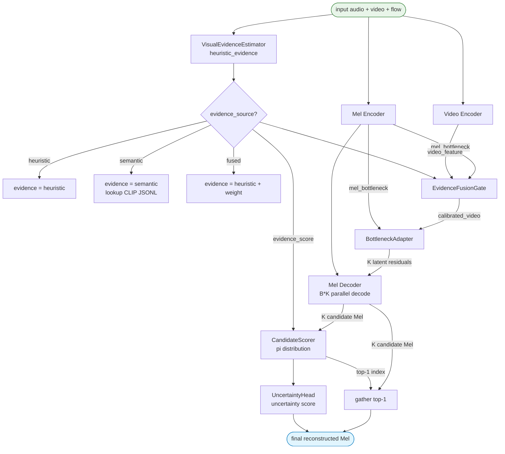
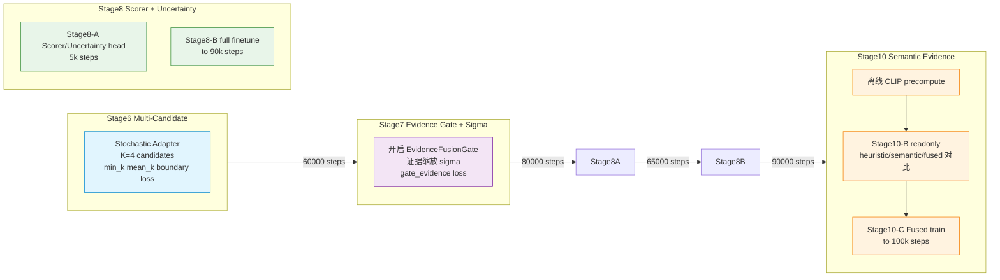

# EC-VIAI-AV 架构文档

## 整体 Pipeline 概览

下图展示从输入到输出的完整数据流主线。

```mermaid
flowchart LR
    subgraph Input["输入"]
        AUDIO["Audio Mel-spectrogram"]
        VIDEO["Video + Optical Flow"]
    end

    subgraph Encoding["编码"]
        ME["Mel Encoder"]
        VE["VideoEncoder"]
    end

    subgraph Evidence["证据估计"]
        HEE["VisualEvidenceEstimator<br/>heuristic evidence"]
        SE["CLIP Semantic Table<br/>semantic evidence"]
        FUSE["证据融合 evidence_score<br/>fused = heuristic + weight"]
    end

    subgraph Gate["门控融合"]
        EG["EvidenceFusionGate<br/>gate = sigmoid MLP(audio, video, evidence)<br/>calibrated = gate x video + (1-gate) x prior"]
    end

    subgraph Sample["多候选采样"]
        BA["BottleneckAdapter Stochastic<br/>mu, logvar to sample K=4 latent"]
    end

    subgraph Decode["解码 K 候选"]
        DEC["Mel Decoder<br/>K 个候选并行解码<br/>to K Mel reconstructions"]
    end

    subgraph Select["排序选择和不确定性"]
        CS["CandidateScorer<br/>pi = softmax based on<br/>proxy L1 + boundary + sync"]
        UH["UncertaintyHead<br/>input: audio, video, 7-dim stats<br/>to uncertainty 0-1"]
        TOP1["gather top-1 from K Mel"]
    end

    subgraph Output["输出"]
        RECON["最终 Mel-spectrogram"]
    end

    AUDIO --> ME
    VIDEO --> VE
    VIDEO --> HEE
    VE --> HEE

    ME --> |mel_bottleneck| EG
    VE --> |video_feature| EG

    HEE --> FUSE
    SE --> FUSE
    FUSE --> |evidence_score| EG
    FUSE --> |evidence_score| CS
    FUSE --> |evidence_score| UH

    EG --> |calibrated_video| BA
    ME --> BA

    BA --> |K latent residuals<br/>added to mel_features| DEC

    DEC --> |K candidate Mel| CS
    DEC --> |K candidate Mel| TOP1

    CS --> |top-1 index| TOP1
    CS --> |pi distribution| Select

    UH --> |uncertainty| Output

    TOP1 --> RECON

    style Input fill:#ffebee,stroke:#b71c1c,color:#000
    style Encoding fill:#e1f5fe,stroke:#0288d1,color:#000
    style Evidence fill:#fff3e0,stroke:#f57c00,color:#000
    style Gate fill:#f3e5f5,stroke:#7b1fa2,color:#000
    style Sample fill:#e8f5e9,stroke:#388e3c,color:#000
    style Decode fill:#f9fbe7,stroke:#afb42b,color:#000
    style Select fill:#fce4ec,stroke:#c2185b,color:#000
    style Output fill:#e0f7fa,stroke:#00695c,color:#000
```

**关键数据流（对应代码 `_forward_inpainter` line 840-950 + `_score_and_select_candidates` line 757-838）：**

1. **音频** → Mel Encoder → mel_bottleneck (256ch)
2. **视频 + 光流** → VideoEncoder → video_feature (256ch)
3. **video_feature** → VisualEvidenceEstimator → heuristic_evidence (0~1)
4. **heuristic + semantic** → 证据融合 → evidence_score
5. **mel_bottleneck + video_feature + evidence_score** → EvidenceFusionGate
   - gate = sigmoid(MLP(audio, video, evidence_score)) → gate_value (0~1)
   - calibrated_video = gate × video + (1-gate) × audio_prior
6. **mel_bottleneck + calibrated_video** → BottleneckAdapter.sample_residuals()
   - 采样 K=4 个 latent residual → 加到 mel_features[-1] → K 个不同的 bottleneck feature
7. **K 个 bottleneck feature** → Mel_Decoder (并行 B*K) → **K 个候选 Mel 图**
8. **K 个候选 Mel + evidence_score** → CandidateScorer (基于 proxy L1 + boundary + sync 三个统计量) → π 分布
9. **K 个候选 Mel + top-1 index** → gather → **最终重建 Mel**
10. **同时 UncertaintyHead(audio, video, 7维统计量)** → uncertainty 分数 (0~1)

---

## 详细架构图

---

## 推理流程 (Test-time)

---

## 训练流水线 (Stage 6→10)

---

## 模块参数说明

| 模块 | 类名 | 输入 | 输出 | 参数 |
|------|------|------|------|------|
| 视频编码器 | `ImageEmbedding` | 视频帧 | video_feature (256ch) | - |
| 梅尔编码器 | `MelEncoder` | Mel-spectrogram | mel_bottleneck (256ch) | - |
| 启发式证据 | `VisualEvidenceEstimator` | flow, video_feature, audio_feature | heuristic_evidence (0~1) | 无参数（规则驱动） |
| 语义证据表 | `SemanticEvidenceTable` | sample_dir | semantic_evidence | weight=0.35, missing_score=0.0 |
| 证据融合门 | `EvidenceFusionGate` | audio_bottleneck, video_feature, evidence_score | calibrated_video, gate_value | 256ch hidden |
| 瓶颈适配器 | `BottleneckAdapter` | mel_bottleneck, video_feature | K latent residuals | 256ch, scale |
| 梅尔解码器 | `MelDecoderImage` | mel_features + K latent residuals | K candidate Mel | - |
| 候选排序器 | `CandidateScorer` | candidate_stats, audio, video, evidence | logits, pi | 256ch hidden |
| 不确定性头 | `UncertaintyHead` | audio, video, 7-dim stats | uncertainty (0~1) | 256ch hidden |

---

## 关键参数命令行标志

| CLI 标志 | 功能 | 阶段 |
|----------|------|------|
| `--use_gan` | 启用 PatchGAN 判别器 | All |
| `--enable_ec_viai_av` | 启用 EC 模块 | All |
| `--stochastic_adapter` | 随机适配器（K 候选） | Stage6+ |
| `--enable_evidence_gate` | 证据门控 | Stage7+ |
| `--enable_evidence_scaled_sigma` | evidence 缩放 sigma | Stage7+ |
| `--enable_candidate_scorer` | 候选排序器 + 不确定性 | Stage8+ |
| `--evidence_source` | heuristic/semantic/fused | Stage10 |
| `--semantic_evidence_path` | CLIP 预计算 JSONL 路径 | Stage10 |
| `--semantic_evidence_weight` | 语义证据融合权重 (0.35) | Stage10 |