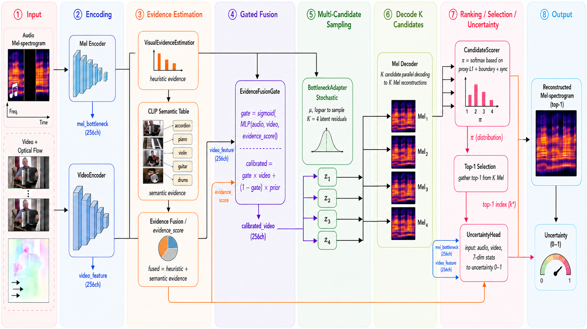
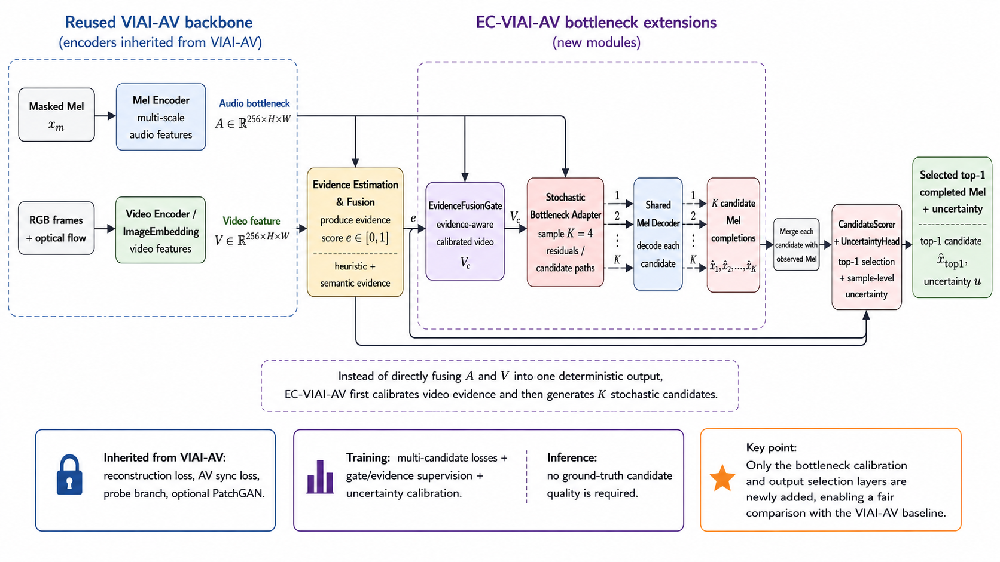
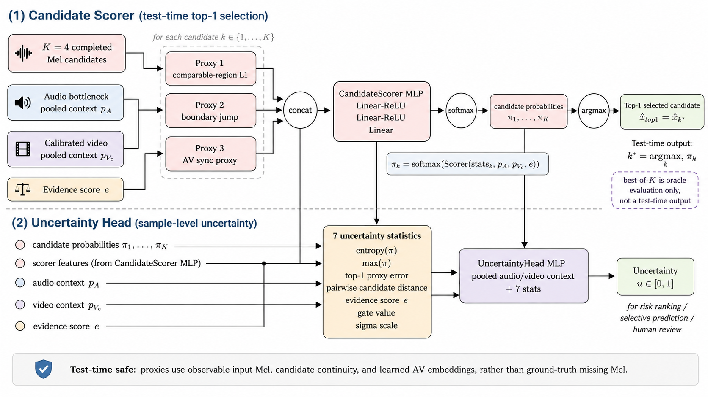

# 方法初稿：EC-VIAI-AV 证据校准多候选音视频联合音频修复

## 3.1 方法概述

本文提出 **EC-VIAI-AV**，即 Evidence-Calibrated Multi-Hypothesis VIAI-AV。该方法不是重新设计一个全新的音视频修复主干，而是在已验证有效的 VIAI-AV backbone 上进行可退化扩展：当视觉证据可靠时，模型更充分地利用视频信息；当视觉证据弱、缺失或语义不匹配时，模型降低视觉分支的影响，生成多个合理候选，并输出样本级不确定性。

传统 VIAI-AV 可写为一个确定性单输出模型：

```text
\hat{x} = f_\theta(x_m, v, m)
```

其中 `x_m` 表示 masked Mel-spectrogram，`v` 表示视频输入，`m` 表示缺失区域 mask。该形式默认缺失音频只有一个确定答案，也默认视频条件始终可靠。然而在实际音视频修复中，视频可能存在静止、遮挡、无光流、缺失、跨乐器错配等情况。因此，本文将确定性修复扩展为 evidence-calibrated multi-hypothesis prediction：

```text
\{\hat{x}_1, \hat{x}_2, ..., \hat{x}_K\}, u
  = F_\theta(x_m, v, m)
```

其中 `K` 为候选数量，`\hat{x}_k` 是第 `k` 个修复候选，`u` 是样本级不确定性。测试时，模型通过 Candidate Scorer 在不访问真实缺失音频的条件下选择 top-1 candidate 作为最终输出。

整体流程如图 1 所示。



图 1 展示了本文方法的整体思想：首先从 masked Mel 和视频中提取音频、RGB 与 optical flow 表征；随后估计视觉证据强度，并通过 evidence-aware gate 校准视频特征；接着在 bottleneck 处进行 stochastic multi-hypothesis sampling，生成多个候选 Mel completion；最后通过 candidate scorer 选择 top-1，并由 uncertainty head 输出样本级不确定性。

## 3.2 问题定义

给定完整 Mel-spectrogram `x`、缺失区域 mask `m`、被遮挡后的输入 `x_m` 以及对应视频 `v`，音视频联合音频修复的目标是在缺失区域内恢复合理的 Mel 片段。本文约定 `m=1` 表示缺失区域，`m=0` 表示已知区域。模型只预测缺失区域内容，已知区域始终保留输入：

```text
\tilde{x}_k = x_m \odot (1 - m) + y_k \odot m
```

其中 `y_k` 是第 `k` 个候选预测，`\tilde{x}_k` 是合成后的完整 Mel-spectrogram。该设计保证模型不会修改已知音频上下文，而只负责补全缺失片段。

与确定性方法不同，本文输出 `K` 个候选：

```text
\{y_1, ..., y_K\} = F_\theta(x_m, v, m)
```

训练时，候选池通过 min-of-K、mean-of-K、boundary continuity 和 diversity 约束共同优化；测试时，Candidate Scorer 输出每个候选的概率：

```text
\pi_k = \operatorname{softmax}(s_k)
```

最终选择：

```text
k^* = \arg\max_k \pi_k
```

最终输出为 `\tilde{x}_{k^*}`。同时，Uncertainty Head 输出 `u \in [0, 1]`，用于估计当前样本的修复风险。

## 3.3 EC-VIAI-AV Backbone

EC-VIAI-AV 继承原始 VIAI-AV 的主要生成结构，包括 Mel Encoder、RGB Video Encoder、Optical Flow Encoder、音视频融合解码器、同步约束分支、probe branch 以及可选 PatchGAN 判别器。这样做的目的不是替换 VIAI-AV 的基础修复能力，而是在其 bottleneck 与候选选择层引入证据校准和不确定性建模。

Backbone 的基本路径如下：

```text
x_m -> Mel Encoder -> audio bottleneck A
v_rgb, v_flow -> Video Encoders -> video feature V
[A, V] -> AV Fusion Decoder -> Mel completion
```

在不启用 EC 扩展时，该结构退化为原始 VIAI-AV 风格的单输出修复路径。启用 EC-VIAI-AV 后，模型在 bottleneck 处加入 evidence estimation、fusion gate、stochastic adapter 和 candidate scorer，使其能够根据视觉证据强弱自适应地调整视觉依赖程度与候选多样性。

图 2 给出了 EC-VIAI-AV backbone 的结构示意。



这种设计有两个优点。第一，它保持了与原始 VIAI-AV 的可比性，避免将性能变化归因于完全不同的主干网络。第二，它使本文的贡献集中在视觉证据校准、多候选生成和不确定性估计上，而不是简单依靠更大的生成器提升重建质量。

## 3.4 视觉证据估计

音视频修复中的视频并不总是可靠。一个视频可能包含明显的发声动作，也可能几乎静止、光流很弱、画面缺失，甚至来自错误乐器。因此，EC-VIAI-AV 首先估计一个视觉证据分数：

```text
e \in [0, 1]
```

其中 `e` 越高，表示当前视频越可能提供可靠的修复线索；`e` 越低，表示模型不应盲目依赖视频分支。

本文使用两类 evidence source：

1. **Heuristic evidence**：基于 optical flow magnitude、temporal variation、视频特征强度和音视频同步 proxy 等低级信号。该分数主要反映“视频中是否存在足够强的运动/同步证据”。
2. **Semantic evidence**：基于离线 CLIP sidecar 预计算的 target-specific semantic score。它不判断当前视频像不像自己的类别，而是判断当前视频是否像原始音频对应的乐器：

```text
e_sem = P(source_instrument | current_video_frames)
```

在正常视频下，`source_instrument` 与视频内容一致，semantic evidence 应较高；在 `wrong_video_cross_instrument` 下，视频来自另一个乐器，semantic evidence 应显著降低。

当同时使用 heuristic 与 semantic evidence 时，本文采用线性融合：

```text
e = \operatorname{clamp}((1 - w)e_h + w e_s, 0, 1)
```

其中 `e_h` 为 heuristic evidence，`e_s` 为 semantic evidence，`w` 为 semantic evidence weight。实验中默认使用 `w=0.35`。

视觉证据估计模块如图 3 所示。


需要强调的是，heuristic evidence 更擅长检测运动证据和视频质量退化，而 semantic evidence 则补充了跨乐器语义错配检测能力。二者结合后，模型既能识别 `flow_zero`、`no_video` 等视觉退化，也能识别 `wrong_video_cross_instrument` 这类低级运动仍然存在但语义不匹配的情况。

## 3.5 Evidence-Aware Fusion Gate

获得视觉证据分数后，模型需要决定应当在多大程度上使用视频特征。为此，本文引入 Evidence-Aware Fusion Gate。该模块根据音频 bottleneck、视频特征和 evidence score 预测一个 gate：

```text
g = \sigma(\operatorname{MLP}([p_A, p_V, e]))
```

其中 `p_A` 和 `p_V` 分别表示音频与视频特征的 pooled representation，`e` 是视觉证据分数，`g \in [0,1]` 表示视觉特征的可信度。

为了在视觉不可靠时提供稳定替代，模型从 audio bottleneck 生成 audio prior `P`，并用 gate 对视频特征进行校准：

```text
V_c = g \cdot V + (1 - g) \cdot P
```

其中 `V_c` 是 calibrated video feature。直观地说，当视觉证据强时，`g` 较大，模型更多保留视频信息；当视觉证据弱或语义不匹配时，`g` 较小，模型更多依赖 audio prior，从而减少错误视频对解码器的误导。

Evidence-Aware Fusion Gate 如图 4 所示。


该模块使模型从“默认使用视频”转向“有条件地信任视频”。这是本文鲁棒性提升的关键机制之一。

## 3.6 不确定性感知的多候选采样

确定性单输出模型无法表达同一音频上下文下可能存在多个合理补全。EC-VIAI-AV 因此在 bottleneck 处引入 stochastic adapter，用于生成多个候选。给定音频 bottleneck `A` 和校准后的视频特征 `V_c`，adapter 预测 latent residual distribution：

```text
\mu, \log\sigma^2 = h([A, V_c])
```

随后采样 `K` 个 latent residual：

```text
z_k = \mu + s_\sigma \sigma \epsilon_k
```

其中 `\epsilon_k \sim \mathcal{N}(0, I)`，`s_\sigma` 是 evidence-conditioned sigma scale。本文保留 deterministic anchor：

```text
\epsilon_1 = 0
```

因此，第一个候选是稳定的 deterministic candidate，用于保持与 baseline 相近的重建路径；其余候选通过随机扰动表达多解性。

Sigma scale 由 evidence 或 gate target 控制：

```text
s_\sigma = \phi(e)
```

当视觉证据强时，`s_\sigma` 较小，候选更集中；当视觉证据弱、缺失或语义不匹配时，`s_\sigma` 较大，候选多样性增加。这一设计使候选多样性与视觉可靠性相关联，而不是固定地在所有样本上注入同样强度的随机性。

多候选采样模块如图 5 所示。


## 3.7 Candidate Scorer

生成多个候选后，模型需要在测试时选择最终输出。需要注意的是，测试阶段不能访问真实缺失 Mel，因此 scorer 不能直接根据 ground-truth error 选择候选。本文设计 Candidate Scorer，仅使用测试时可获得的 proxy statistics 对候选进行评分。

候选统计特征包括：

- 候选与已知 Mel 区域的一致性 proxy；
- 缺失边界处的 boundary jump；
- audio-video sync proxy；
- pooled audio context；
- pooled calibrated video context；
- evidence score。

Candidate Scorer 输出每个候选的 logit：

```text
s_k = \operatorname{Scorer}(\operatorname{stats}_k, p_A, p_{V_c}, e)
```

并通过 softmax 得到候选概率：

```text
\pi_k = \frac{\exp(s_k)}{\sum_j \exp(s_j)}
```

最终选择概率最大的候选作为 top-1：

```text
k^* = \arg\max_k \pi_k
```

本文区分两个评估概念：

- **Top-1**：Candidate Scorer 在测试时实际选择的输出，是模型真实可用性能。
- **Best-of-K**：使用 ground truth 选择候选池中误差最小的 oracle 指标，只用于衡量候选池上限，不作为实际输出。

该区分非常重要。若 best-of-K 明显优于 top-1，说明候选池中存在更好的解，但 scorer 仍有提升空间；若 top-1 优于 random candidate，则说明 scorer 已经学习到一定的候选排序能力。

## 3.8 Uncertainty Head

除了选择 top-1 candidate，模型还需要估计当前样本的修复不确定性。EC-VIAI-AV 使用 Uncertainty Head 输出：

```text
u \in [0, 1]
```

其中 `u` 越高表示模型认为当前修复风险越高。Uncertainty Head 的输入包括候选分布和证据相关特征，例如：

- candidate probability entropy；
- top candidate confidence；
- candidate pairwise distance；
- evidence score；
- gate value；
- sigma scale；
- top-1 proxy error。

Uncertainty Head 的结构如图 6 所示。



训练目标是使 `u` 与真实 reconstruction error 正相关。实验中使用 Pearson/Spearman correlation、risk-coverage curve 和 calibration bins 等指标评估不确定性是否能够有效排序样本风险。

## 3.9 训练目标

EC-VIAI-AV 的训练目标由基础重建、多候选优化、边界连续性、候选多样性、候选选择、不确定性校准、音视频同步和对抗损失组成。简化写法如下：

```text
\mathcal{L}
= \mathcal{L}_{AV}
+ \lambda_{minK}\mathcal{L}_{minK}
+ \lambda_{meanK}\mathcal{L}_{meanK}
+ \lambda_{bd}\mathcal{L}_{boundary}
+ \lambda_{div}\mathcal{L}_{evidence-div}
+ \lambda_{score}\mathcal{L}_{score}
+ \lambda_{calib}\mathcal{L}_{uncertainty}
```

其中基础 VIAI-AV 损失为：

```text
\mathcal{L}_{AV}
= \lambda_{rec}\mathcal{L}_{rec}
+ \lambda_{sync}\mathcal{L}_{sync}
+ \lambda_{probe}\mathcal{L}_{probe}
+ \lambda_{gan}\mathcal{L}_{gan}
```

各项损失的作用如下：

| 损失项 | 作用 |
| --- | --- |
| `L_rec` | 保持 Mel reconstruction 质量。 |
| `L_anchor` | 稳定 deterministic candidate，保持可退化的单输出路径。 |
| `L_sync` | 维持音视频同步约束。 |
| `L_probe` | 沿用 VIAI-AV probe branch，提高音频表征约束。 |
| `L_gan` | 可选 PatchGAN 对抗约束，提高局部结构质量。 |
| `L_minK` | 鼓励候选池中至少一个候选接近真实缺失片段。 |
| `L_meanK` | 防止只有单个候选较好而其他候选崩坏。 |
| `L_boundary` | 保证缺失区域边界连续，减少接缝断裂。 |
| `L_evidence-div` | 使低 evidence 样本具有更高候选多样性。 |
| `L_score` | 训练 Candidate Scorer 接近 oracle best candidate。 |
| `L_uncertainty` | 使 uncertainty score 与真实 error 正相关。 |
| `L_gate` | 使 visual gate 响应 evidence-derived gate target。 |

下面给出关键损失项的具体形式。设 `x` 为真实 Mel-spectrogram，`m` 为缺失区域 mask，`\tilde{x}_k` 为第 `k` 个完整候选输出。第 `k` 个候选在缺失区域的重建误差定义为：

```text
r_k
= \frac{\|m \odot (\tilde{x}_k - x)\|_1}
        {\|m\|_1 + \epsilon}
```

其中 `\epsilon` 用于避免除零。测试时报告的 `top1_missing_l1`、`best_of_k_missing_l1` 等指标都基于该候选级 missing-region error。

### 3.9.1 Reconstruction 与 deterministic anchor

EC-VIAI-AV 保留第一个候选作为 deterministic anchor，即 `\epsilon_1 = 0`。该候选不引入随机噪声，用于稳定训练并保持与原始 VIAI-AV 相近的重建路径。anchor reconstruction loss 写为：

```text
\mathcal{L}_{anchor}
= r_1
```

基础重建项也可以写成对 top-1 或 anchor 的 missing-region L1：

```text
\mathcal{L}_{rec}
= \frac{\|m \odot (\hat{x} - x)\|_1}
        {\|m\|_1 + \epsilon}
```

其中 `\hat{x}` 可以是 anchor candidate，也可以是 scorer 选择的 top-1 candidate。实际训练中，anchor 保证模型不会因为 stochastic branch 而偏离稳定的单输出修复路径。

### 3.9.2 Min-K 与 Mean-K 多候选损失

为鼓励候选池覆盖多个可能解，本文使用 min-of-K loss：

```text
\mathcal{L}_{minK}
= \min_{k \in \{1,\dots,K\}} r_k
```

该损失只要求候选池中至少有一个候选接近真实缺失片段，因此能够提升 candidate pool 的 oracle upper bound，也就是实验中的 `best_of_k_missing_l1`。

仅使用 min-of-K 容易导致一个候选较好、其余候选质量崩坏。因此本文同时加入 mean-of-K loss：

```text
\mathcal{L}_{meanK}
= \frac{1}{K}\sum_{k=1}^{K} r_k
```

该项约束所有候选保持基本可用，避免候选池中出现大量无效样本。二者共同作用，使模型既能保留 best-of-K 上限，又能维持整体候选质量。

### 3.9.3 Boundary continuity loss

为了避免补全片段与已知音频上下文在边界处出现突变，本文加入 boundary loss。设缺失区域在时间维度上的起止位置为 `t_s` 和 `t_e`，则可写为：

```text
\mathcal{L}_{boundary}
= \frac{1}{K}\sum_{k=1}^{K}
  \left(
  \|\tilde{x}_k[:, t_s] - \tilde{x}_k[:, t_s - 1]\|_1
  +
  \|\tilde{x}_k[:, t_e] - \tilde{x}_k[:, t_e - 1]\|_1
  \right)
```

该项不直接追求候选与 ground truth 的距离，而是约束缺失区域边缘与已知区域自然衔接，从而减少 audible discontinuity 和 spectrogram seam。

### 3.9.4 Evidence-conditioned diversity loss

候选多样性不应在所有样本上固定增加。直观上，当视觉证据强时，模型应更确定，候选之间可以更集中；当视觉证据弱、缺失或语义不匹配时，模型应允许更多可能补全。为此，定义候选间平均距离：

```text
d
= \frac{2}{K(K-1)}
  \sum_{i<j}
  \frac{\|m \odot (\tilde{x}_i - \tilde{x}_j)\|_1}
       {\|m\|_1 + \epsilon}
```

给定 evidence score `e`，低 evidence 样本对应更高的目标多样性：

```text
d_{target}
= d_{min} + \alpha(1 - e)
```

其中 `d_min` 是最低多样性阈值，`\alpha` 控制 evidence 对多样性的调节强度。Evidence-conditioned diversity loss 写为：

```text
\mathcal{L}_{evidence-div}
= \max(0, d_{target} - d)
```

因此，当 `e` 较低且候选过于相似时，该损失会推动候选分散；当候选多样性已经足够或视觉证据较强时，该项影响减弱。

### 3.9.5 Candidate scorer loss

Candidate Scorer 的训练目标是让测试时可用的 proxy statistics 尽可能接近 oracle candidate selection。训练时可以访问 ground truth，因此先根据 `r_k` 找到 oracle best candidate：

```text
k^{oracle}
= \arg\min_k r_k
```

Candidate Scorer 输出 logits `s_k` 和概率 `\pi_k`：

```text
\pi_k
= \frac{\exp(s_k)}
        {\sum_j \exp(s_j)}
```

Scorer loss 使用交叉熵：

```text
\mathcal{L}_{score}
= -\log \pi_{k^{oracle}}
```

需要强调的是，`k^{oracle}` 只在训练时用于监督 scorer；测试时模型不能访问真实缺失 Mel，只能根据 candidate proxy statistics 预测 `\pi_k` 并选择 top-1。

### 3.9.6 Uncertainty calibration loss

Uncertainty Head 输出样本级不确定性 `u`，目标是使其与实际 top-1 reconstruction error 正相关。设 top-1 candidate 的真实 missing error 为：

```text
r_{top1} = r_{k^*}
```

本文将 error 映射为软目标：

```text
q
= \operatorname{clip}
  \left(
  \frac{r_{top1}}{\tau},
  0,
  1
  \right)
```

其中 `\tau` 是 error temperature 或 calibration threshold。Uncertainty calibration loss 可写为：

```text
\mathcal{L}_{uncertainty}
= \operatorname{BCE}(u, q)
```

该目标鼓励高 error 样本具有更高 uncertainty，低 error 样本具有更低 uncertainty。实验中进一步使用 Pearson/Spearman correlation、risk-coverage curve 和 calibration bins 检验 `u` 是否真的能排序样本风险。

### 3.9.7 Evidence gate supervision

当启用 evidence-aware gate 时，模型还使用 evidence-derived gate target 监督 gate 输出。设 evidence score 为 `e`，gate target 可由区间映射得到：

```text
g^*
= \operatorname{clip}
  \left(
  \frac{e - e_{low}}
       {e_{high} - e_{low} + \epsilon},
  0,
  1
  \right)
```

gate supervision loss 为：

```text
\mathcal{L}_{gate}
= \|g - g^*\|_1
```

该项使 gate 学会响应 evidence：高 evidence 对应较高视觉信任，低 evidence 对应较低视觉信任。在 semantic perturbation training 中，`wrong_video_cross_instrument` 和 `no_video` 会产生低 `g^*`，从而训练模型在不可靠视觉输入下主动降低 visual gate。

因此，更完整的训练目标可写为：

```text
\mathcal{L}
= \mathcal{L}_{AV}
+ \mathcal{L}_{anchor}
+ \lambda_{minK}\mathcal{L}_{minK}
+ \lambda_{meanK}\mathcal{L}_{meanK}
+ \lambda_{bd}\mathcal{L}_{boundary}
+ \lambda_{div}\mathcal{L}_{evidence-div}
+ \lambda_{score}\mathcal{L}_{score}
+ \lambda_{calib}\mathcal{L}_{uncertainty}
+ \lambda_{gate}\mathcal{L}_{gate}
```

在训练中，第一个 candidate 作为 deterministic anchor，稳定基础重建路径；其余 candidates 用于表达多解性。这样可以避免随机采样破坏原有 VIAI-AV 的重建能力，同时为不确定场景提供候选多样性。

## 3.10 语义扰动训练

前述 evidence 与 gate 机制只有在训练中见过低 evidence 样本时，才能真正学会响应低视觉可信度。因此，本文进一步引入 semantic-aware perturbation training。训练时以一定概率对视频分支施加扰动，包括：

- `flow_zero`：将 optical flow 置零，模拟运动证据缺失；
- `no_video`：将 RGB/flow 置零，模拟无视频输入；
- `wrong_video_cross_instrument`：用另一个乐器类别的视频替换当前视频，模拟语义错配。

对于 `wrong_video_cross_instrument`，semantic evidence lookup 使用替换后的视频路径，但 target instrument 使用原始音频所属乐器。因此 evidence 表示的是：

```text
P(source_instrument | wrong_video_frames)
```

这一步是必要的。如果直接使用 wrong video 自身的类别作为 target，模型会得到错误的高 semantic score，例如 “accordion video -> accordion prompt”。本文使用 source-instrument 条件分数，使 cross-instrument wrong video 得到低 semantic evidence，从而为 gate 提供正确监督。

扰动训练的目标不是让模型简单忽略视频，而是让模型区分三种情况：

1. 视频可靠：提高视觉依赖，候选更集中；
2. 视频缺失或运动证据弱：降低视觉依赖，提高不确定性；
3. 视频语义不匹配：降低视觉 gate，避免错误视觉条件误导修复。

## 3.11 推理流程

推理阶段不访问真实缺失 Mel。给定 masked Mel、mask 和视频输入，EC-VIAI-AV 按以下步骤生成最终修复结果：

1. 使用 Mel Encoder 提取音频 bottleneck `A`；
2. 使用 RGB/flow encoders 提取视频特征 `V`；
3. 计算 heuristic evidence，并可选查表获得 semantic evidence；
4. 融合得到最终 evidence score `e`；
5. 使用 Evidence-Aware Fusion Gate 得到 calibrated video feature `V_c`；
6. 根据 evidence-conditioned sigma scale 在 bottleneck 处采样 `K` 个 latent residual；
7. 解码得到 `K` 个 Mel completion candidates；
8. Candidate Scorer 根据测试时可用 proxy statistics 选择 top-1；
9. Uncertainty Head 输出样本级不确定性 `u`；
10. 将 top-1 candidate 填入缺失区域，并保留已知区域不变。

最终输出包括：

```text
\tilde{x}_{k^*}, \quad u, \quad \{\pi_k\}_{k=1}^{K}
```

其中 `\tilde{x}_{k^*}` 是最终修复 Mel，`u` 是不确定性分数，`\pi_k` 是候选概率分布。

## 3.12 方法小结

EC-VIAI-AV 的核心不是简单生成更多候选，而是将候选生成、视觉证据、语义可靠性和不确定性估计统一到一个 evidence-calibrated 框架中。与原始 VIAI-AV 相比，该方法具有三点关键差异：

1. **从单输出到多候选**：模型能够表达同一上下文下的多个合理音频补全。
2. **从默认信任视频到条件信任视频**：模型根据 heuristic 与 semantic evidence 自适应调整 visual gate。
3. **从只输出结果到输出风险估计**：模型同时给出 uncertainty score，用于反映样本级错误风险。

因此，本文方法尤其适用于视觉证据不稳定的音视频联合音频修复场景，例如视频缺失、光流弱化、静止画面以及跨乐器语义错配。
