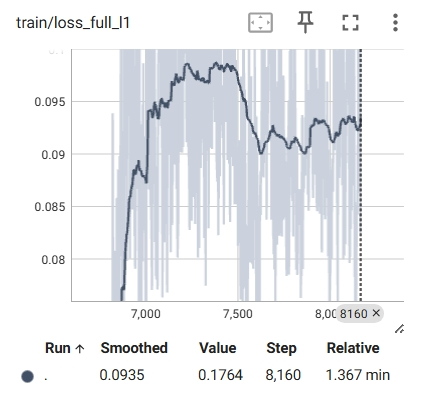
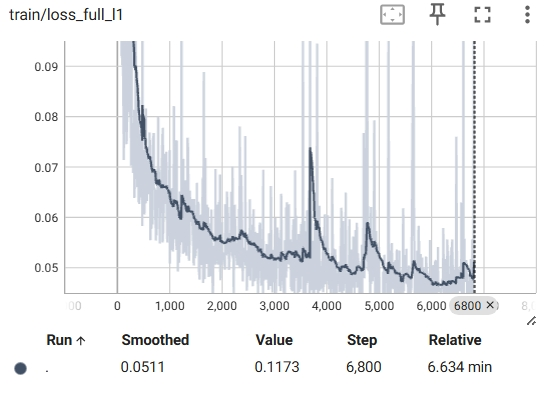

# 实验排查记录

### 2026-05-17 17:37:01 CST - VIAI-AV loss 方向异常排查

#### 背景

训练命令：

```bash
python main.py train-viai-av -- \
  --data_root "$DATA_ROOT" \
  --train_split_name train_av_split.txt \
  --val_split_name val_av_split.txt \
  --init_from_viai_a checkpoints/VIAI-A-PatchGAN_checkpoint_step000006800.pth.tar \
  --batch_size 16 \
  --num_workers 4 \
  --beta_gan 0.1 \
  --checkpoint_interval 1000 \
  --print_freq 100 \
  --display_id 0
```

现象：TensorBoard 中 `train/loss_full_l1`、`train/loss_missing_l1` 上升，`train/psnr_full`、`train/psnr_missing` 下降；验证集同样变差，表现为“越训越差”。

#### 已确认事实

1. 本次导出的 `output.txt` 中没有 `train/loss_sync`、`train/loss_probe_gen`、`train/eta2` 等标量。
2. 因此这次 7126-step 结果不是当前 Stage4 sync/probe 默认开启后的日志，而是旧 Stage3 风格的 VIAI-AV run，或 TensorBoard 指向了旧 event 文件。
3. 论文公式摘录中 VIAI-AV generator loss 为：

```text
L_av_gen = L_av_GAN + beta * L_av_re
L_av_re = eta1(t) * full_l1 + missing_l1
```

4. 当前代码 `Models/VIAI_AV_inpainting.py` 中的实现与论文公式一致：

```python
loss_recon = eta1 * loss_full_l1 + loss_missing_l1
loss_av_gen = loss_G_GAN + beta_gan * loss_recon
```

注意：这里的 `beta_gan` 参数名很容易误导。它在当前代码里实际对应论文中的 `beta`，也就是 reconstruction loss 的权重，不是 GAN loss 的权重。

#### 关键标量证据

7126-step run 的末尾标量：

```text
train/loss_total       last = 0.767486
train/loss_g_gan       last = 0.745425
train/loss_recon       last = 0.220610
train/loss_full_l1     last = 0.119271
train/loss_missing_l1  last = 0.164309
train/eta1             last = 0.472039
train/psnr_full        last = 16.311
train/psnr_missing     last = 13.952

val/loss_total         last = 0.947441
val/loss_g_gan         last = 0.918362
val/loss_recon         last = 0.290781
val/loss_full_l1       last = 0.115067
val/loss_missing_l1    last = 0.175714
val/eta1               last = 1.000000
val/psnr_full          last = 16.765
val/psnr_missing       last = 13.485
```

在训练命令 `--beta_gan 0.1` 下：

```text
beta_gan * train/loss_recon ~= 0.1 * 0.220610 = 0.022061
train/loss_g_gan ~= 0.745425
```

因此总损失几乎由 GAN loss 主导，重建 L1 对优化方向的约束很弱。这可以解释 L1/PSNR 随训练变差。

#### 初步结论

当前 loss 公式没有相对论文写反；更可能的问题是训练配置中 `--beta_gan 0.1` 让 reconstruction loss 权重过小。若使用者把 `beta_gan` 理解成“GAN loss 权重”，就会和当前代码语义相反。

另外，`Models/VIAI_AV_inpainting.py` 的 `test()` 中调用 `_compute_losses(global_step=0)`，导致验证阶段 `val/eta1` 永远为 1.0。这个问题不会直接影响 PSNR，但会让 `val/loss_recon`、`val/loss_total` 的权重语义与训练当前 step 不一致。

#### 建议验证实验

优先做短跑对照，确认是否是重建项权重过小导致反向优化。

实验 A：提高 reconstruction 权重到 1.0。

```bash
python main.py train-viai-av -- \
  --data_root "$DATA_ROOT" \
  --train_split_name train_av_split.txt \
  --val_split_name val_av_split.txt \
  --init_from_viai_a checkpoints/VIAI-A-PatchGAN_checkpoint_step000006800.pth.tar \
  --batch_size 16 \
  --num_workers 4 \
  --beta_gan 1.0 \
  --checkpoint_interval 1000 \
  --print_freq 100 \
  --display_id 0 \
  --log_event_path checkpoints/events_viai_av_beta1
```

实验 B：进一步提高 reconstruction 权重到 10.0。

```bash
python main.py train-viai-av -- \
  --data_root "$DATA_ROOT" \
  --train_split_name train_av_split.txt \
  --val_split_name val_av_split.txt \
  --init_from_viai_a checkpoints/VIAI-A-PatchGAN_checkpoint_step000006800.pth.tar \
  --batch_size 16 \
  --num_workers 4 \
  --beta_gan 10.0 \
  --checkpoint_interval 1000 \
  --print_freq 100 \
  --display_id 0 \
  --log_event_path checkpoints/events_viai_av_beta10
```

判断标准：

1. 若 `train/loss_full_l1`、`train/loss_missing_l1` 不再持续上升，且 `train/psnr_full`、`train/psnr_missing` 不再持续下降，则基本坐实主因是 reconstruction 权重过小。
2. 若 `val/psnr_missing` 也随之改善，说明问题不是单纯过拟合，而是目标函数权重方向导致训练目标与评估指标不一致。
3. 若提高 `beta_gan` 后仍恶化，再继续排查视频融合初始化、判别器过强、学习率、数据对齐和 mask 合成逻辑。

#### 后续代码修正建议

为避免再次混淆，建议后续将参数语义改清楚：

```text
--lambda_recon  # reconstruction loss 权重，对应论文 beta
--lambda_gan    # GAN loss 权重，默认 1.0
```

并在 TensorBoard 中额外写入：

```text
train/weighted_loss_recon = beta_gan * loss_recon
train/weighted_loss_gan = loss_g_gan
```

这样之后可以直接看到各 loss 项对总损失的实际贡献。


### 2026-5-20 17:46:    VIAI-A+PatchGan loss 方向异常排查

#### 背景

本次对比的是两组训练曲线：



1. `VIAI-A` audio-only baseline，训练 100 epoch，末尾约 6800 step。
2. `VIAI-A + PatchGAN`，从 `VIAI-A` 第 100 epoch checkpoint 接续训练到 120 epoch，约等于额外训练 20 epoch。

现象：

1. 加入 PatchGAN 后，`train/loss_full_l1` 和 `train/loss_missing_l1` 不再下降，反而明显变差。
2. `train/psnr_full`、`train/ssim_full` 相比纯 `VIAI-A` 明显降低。
3. `train/loss_g_gan` 上升，`train/loss_d` 下降，说明判别器逐渐变强，生成器越来越难骗过判别器。
4. PatchGAN 阶段的 `train/loss_recon`/`train/loss_total` 曲线看起来像从 0 附近骤升。

#### 已确认实现

`VIAI-A + PatchGAN` 没有单独的新生成器。生成器仍然是：

```text
MelEncoder + MelDecoder
```

PatchGAN 部分只新增 Mel 判别器 `MelDiscriminator` 和对应 GAN loss。生成器训练目标为论文第 3 页公式：

```text
L_total = L_GAN + beta * L_re
L_re = eta1(t) * full_l1 + missing_l1
```

当前代码已将 `Models/VIAI_A_inpainting.py` 中的 PatchGAN generator loss 显式整理为：

```python
self.weighted_loss_recon = beta_recon * self.loss_recon
self.weighted_loss_gan = self.loss_G_GAN
self.loss_total = self.weighted_loss_gan + self.weighted_loss_recon
```

并在 `base_options.py` 中新增 `--beta_recon`，同时保留 `--lambda_recon` 作为兼容旧命令的 reconstruction 权重别名。

#### 对曲线的解释

从 `VIAI-A` checkpoint 接续训练本身不是错误，但它会造成一个很明显的训练目标切换：

```text
前 100 epoch:
只优化 L_recon

接续 PatchGAN:
优化 L_GAN + beta * L_recon
```

此时判别器 `netD` 是新加入的，或者至少处于与已有生成器不平衡的状态。生成器原本已经收敛到较好的 L1 重建位置，突然加入 GAN 梯度后，优化方向会被对抗项拉走，因此 `loss_full_l1`、`loss_missing_l1` 变差是合理现象。

`loss` 从 0 附近骤升不一定表示 checkpoint 加载坏了，主要有两个原因：

1. `loss_recon`/`loss_g_gan` 这类 tag 在纯 `VIAI-A` 阶段可能没有写入，开启 PatchGAN 后才开始出现，TensorBoard 会显示为突然出现。
2. PatchGAN 后的 `loss_total` 多了 `loss_g_gan`，而 GAN loss 初始常在 `0.6~0.9` 左右，数值尺度明显大于 L1 reconstruction loss。

#### 初步结论

当前曲线说明：在本次设置下，PatchGAN 对 Mel 频谱图的逐点重建指标是负收益。

更具体地说，它不一定证明 PatchGAN 理论上无效，但说明当前权重/训练节奏下，判别器约束过强，生成器为了骗过判别器牺牲了 `full_l1`、`missing_l1`、PSNR 和 SSIM。

#### 排查与验证方案

优先验证 reconstruction 权重是否过小。建议从同一个 `VIAI-A` 100 epoch checkpoint 开始，做短跑对照实验。

实验 A：提高 reconstruction 权重到 10。

```bash
python main.py train-viai-a -- \
  --use_gan \
  --name VIAI-A-PatchGAN-beta10 \
  --data_root "$DATA_ROOT" \
  --train_split_name train_viai_a_split.txt \
  --val_split_name val_viai_a_split.txt \
  --resume \
  --resume_path checkpoints/VIAI-A_checkpoint_step000006800.pth.tar \
  --reset_optimizer \
  --batch_size 16 \
  --num_workers 4 \
  --beta_recon 10.0 \
  --checkpoint_interval 1000 \
  --print_freq 100 \
  --display_id 0 \
  --log_event_path checkpoints/events_viai_a_patchgan_beta10
```

实验 B：进一步提高 reconstruction 权重到 50。

```bash
python main.py train-viai-a -- \
  --use_gan \
  --name VIAI-A-PatchGAN-beta50 \
  --data_root "$DATA_ROOT" \
  --train_split_name train_viai_a_split.txt \
  --val_split_name val_viai_a_split.txt \
  --resume \
  --resume_path checkpoints/VIAI-A_checkpoint_step000006800.pth.tar \
  --reset_optimizer \
  --batch_size 16 \
  --num_workers 4 \
  --beta_recon 50.0 \
  --checkpoint_interval 1000 \
  --print_freq 100 \
  --display_id 0 \
  --log_event_path checkpoints/events_viai_a_patchgan_beta50
```

实验 C：如果 beta=50 仍不能稳定 L1，再尝试 beta=100。

```bash
python main.py train-viai-a -- \
  --use_gan \
  --name VIAI-A-PatchGAN-beta100 \
  --data_root "$DATA_ROOT" \
  --train_split_name train_viai_a_split.txt \
  --val_split_name val_viai_a_split.txt \
  --resume \
  --resume_path checkpoints/VIAI-A_checkpoint_step000006800.pth.tar \
  --reset_optimizer \
  --batch_size 16 \
  --num_workers 4 \
  --beta_recon 100.0 \
  --checkpoint_interval 1000 \
  --print_freq 100 \
  --display_id 0 \
  --log_event_path checkpoints/events_viai_a_patchgan_beta100
```

#### 判断标准

1. 若提高 `--beta_recon` 后，`train/loss_full_l1`、`train/loss_missing_l1` 不再持续上升，说明主因是 GAN 项相对 reconstruction 项过强。
2. 若 `val/loss_missing_l1`、`val/psnr_missing` 同步改善，说明问题不是单纯训练集波动，而是 loss 权重导致的优化方向偏移。
3. 若 `loss_d` 继续快速下降且 `loss_g_gan` 继续上升，同时 L1 仍变差，说明判别器仍然过强，需要考虑降低判别器学习率、降低判别器更新频率，或冻结生成器/判别器做更平滑的 warm-up。
4. 最终以 `test/mel_l1_missing`、`test/psnr_missing`、Mel 对比图和 vocoder 导出的音频为准。`psnr_full`/`ssim_full` 可作为参考，但实际修复更关注缺失区域。

#### 后续可选改动

若单纯增大 `--beta_recon` 仍不稳定，可以继续做以下改动：

1. 为判别器单独增加学习率参数，例如 `--lr_d`，令 `lr_d < lr_g`。
2. 增加判别器更新间隔，例如每 2 到 5 个 generator step 更新一次 `netD`。
3. PatchGAN 前若从纯 `VIAI-A` checkpoint 热启动，可以先用较大的 `--beta_recon` 训练若干 step，再逐步降低 beta，让 GAN 影响缓慢进入。
4. TensorBoard 重点观察 `weighted_loss_recon`、`weighted_loss_gan`、`loss_d`、`loss_g_gan`、`loss_missing_l1` 和 `psnr_missing`，避免只看 `loss_total`。


### 2026-05-22 - VIAI-A + PatchGAN beta=100 判别器 loss 与训练流程复查

#### 背景

在 `VIAI-A + PatchGAN` 使用 `beta_recon=100` 训练时，TensorBoard 显示：

1. `train/loss_g_gan` 持续上升，生成器越来越难骗过判别器。
2. `train/loss_full_l1` 和 `train/loss_recon` 没有随训练改善，反而上升。
3. 与纯 `VIAI-A` baseline 相比，L1、PSNR、SSIM 等重建指标明显下降。

因此重点复查两个问题：

1. 判别器 loss 的符号是否写反。
2. PatchGAN 接入后，生成器/判别器的训练流程是否存在隐性问题。

#### 判别器 loss 符号检查

当前 `loss_functions.py` 中：

```python
GANLoss(use_lsgan=False)
```

对应的是 `nn.BCELoss()`；`MelDiscriminator` 末尾也有 `Sigmoid()`。因此：

```python
loss_D_real = BCE(D(real), 1)
loss_D_fake = BCE(D(fake.detach()), 0)
loss_D = 0.5 * (loss_D_real + loss_D_fake)
```

在最小化意义下等价于：

```text
L_D = - E[log D(real)] - E[log(1 - D(fake))]
```

也就是说，截图里公式中的负号已经包含在 `BCELoss` 内部；当前判别器 loss 的符号没有明显写反。

#### 更可疑的问题

复查后发现，`VIAI_A_inpainting.py` 中原先存在两个更值得验证的问题。

1. `lambda_gan` 没有参与 VIAI-A PatchGAN 的 generator loss。
   原实现等价于：

```python
loss_total = loss_G_GAN + beta_recon * loss_recon
```

即使命令行传入 `--lambda_gan`，也不会降低 GAN 项权重。

2. 训练生成器时，判别器没有冻结。
   原流程在计算 generator adversarial loss 时执行：

```python
pred_fake = self.netD(self.mel_pred)
```

此时 `netD` 处于 `train()` 状态。虽然 `optimizer_G.step()` 不会更新判别器参数，但 `MelDiscriminator` 内含 `BatchNorm2d`，fake-only 前向会更新判别器的 running mean/var，从而污染判别器状态。

#### 本次验证性代码修改

在 `Models/VIAI_A_inpainting.py` 中将 VIAI-A PatchGAN 的 generator loss 改为显式支持 `lambda_gan`：

```python
self.weighted_loss_recon = beta_recon * self.loss_recon
lambda_gan = getattr(self.hparams, "lambda_gan", 1.0)
self.weighted_loss_gan = lambda_gan * self.loss_G_GAN
self.loss_total = self.weighted_loss_gan + self.weighted_loss_recon
```

同时在 `optimize_parameters()` 中，将 generator step 和 discriminator step 拆清楚：

```python
# 训练生成器时冻结判别器权重，并用 eval() 固定 BatchNorm running stats。
if self.use_gan:
    self.netD.eval()
    for p in self.netD.parameters():
        p.requires_grad = False

self._forward_inpainter()
self._compute_losses(global_step)
self.optimizer_G.zero_grad()
self.loss_total.backward()
self.optimizer_G.step()

# 训练判别器时恢复 train() 和 requires_grad。
if self.use_gan:
    self.netD.train()
    for p in self.netD.parameters():
        p.requires_grad = True

    self.optimizer_D.zero_grad()
    self._compute_discriminator_loss()
    self.loss_D.backward()
    self.optimizer_D.step()
```

这个改动的目的不是证明 PatchGAN 一定能提升指标，而是先排除两个实现层面的干扰：

1. `--lambda_gan` 无效导致 GAN 项无法被调小。
2. G step 的 fake-only 判别器前向污染 BatchNorm running stats。

#### 建议后续验证实验

从同一个 `VIAI-A` baseline checkpoint 出发，优先做短跑对照：

```bash
python main.py train-viai-a -- \
  --use_gan \
  --name VIAI-A-PatchGAN-beta100-lgan01 \
  --data_root "$DATA_ROOT" \
  --train_split_name train_viai_a_split.txt \
  --val_split_name val_viai_a_split.txt \
  --resume \
  --resume_path checkpoints/VIAI-A_checkpoint_step000006800.pth.tar \
  --reset_optimizer \
  --batch_size 16 \
  --num_workers 4 \
  --beta_recon 100.0 \
  --lambda_gan 0.1 \
  --checkpoint_interval 1000 \
  --print_freq 100 \
  --display_id 0 \
  --log_event_path checkpoints/events_viai_a_patchgan_beta100_lgan01
```

若 `lambda_gan=0.1` 仍然导致 `loss_full_l1`、`loss_missing_l1` 和 PSNR 明显恶化，再尝试更保守的：

```text
--beta_recon 100.0 --lambda_gan 0.01
```

#### 判断标准

1. 若降低 `lambda_gan` 后 L1/PSNR 不再持续恶化，说明主因更可能是 GAN 项过强，而不是判别器 loss 符号写反。
2. 若加入 `netD.eval()` 冻结 BatchNorm 后曲线变稳定，说明之前的 fake-only 判别器前向确实影响了 D 的状态统计。
3. 若 `loss_d` 快速下降、`loss_g_gan` 持续上升、L1 仍变差，说明判别器仍然过强，需要继续考虑降低 D 学习率、减少 D 更新频率或做 GAN warm-up。
4. 最终仍以 `test/mel_l1_missing`、`test/psnr_missing`、Mel 对比图和导出音频为准，不只看 `loss_total`。

### 2026-05-24 - VIAI-A PatchGAN 初始化语义记录

#### 背景

在准备 `VIAI-A + PatchGAN` 对照实验时，需要明确以下命令是否会从头训练：

```bash
python main.py train-viai-a -- \
  --use_gan \
  --name VIAI-A-PatchGAN \
  --data_root "$DATA_ROOT" \
  --train_split_name train_viai_a_split.txt \
  --val_split_name val_viai_a_split.txt \
  --init_from_viai_a checkpoints/VIAI-A_checkpoint_step000006800.pth.tar \
  --batch_size 16 \
  --num_workers 4 \
  --beta_recon 1.0 \
  --checkpoint_interval 1000 \
  --print_freq 100 \
  --display_id 0 \
  --nepochs 120
```

#### 三种训练入口语义

1. 不传 `--resume`，也不传 `--init_from_viai_a`：

```text
从零训练 G + D
global_step = 0
global_epoch = 0
Mel_Encoder 随机初始化
Mel_Decoder 随机初始化
netD 随机初始化
optimizer_G / optimizer_D 新建
```

因此，如果上面的命令去掉：

```bash
--init_from_viai_a checkpoints/VIAI-A_checkpoint_step000006800.pth.tar
```

并且也没有传：

```bash
--resume --resume_path ...
```

那么它会变成 `VIAI-A + PatchGAN` 从零开始训练，而不是先复用已经训练好的 `VIAI-A` baseline。

2. 传 `--init_from_viai_a`：

```text
拿预训练权重开一个新实验
Mel_Encoder / Mel_Decoder 从 VIAI-A checkpoint 初始化
若当前启用 --use_gan 且源 checkpoint 没有 netD，则 netD 随机初始化
不继承 global_step / global_epoch / optimizer
TensorBoard 横轴从 0 开始
```

这是当前最适合做 `VIAI-A baseline` vs `VIAI-A + PatchGAN` 对照实验的语义。

3. 传 `--resume --resume_path`：

```text
继续同一次训练
继承 checkpoint 里的 global_step / global_epoch
若未传 --reset_optimizer，也会继承 optimizer 状态
TensorBoard 横轴从 checkpoint step 继续
```

例如从 `VIAI-A_checkpoint_step000006800.pth.tar` resume，则 PatchGAN 阶段会从 step 6800 继续，而不是从 step 0 开始。

#### 当前建议

若目标是“VIAI-A baseline 训练好后，再开启一个新的 PatchGAN 实验”，保留：

```bash
--init_from_viai_a checkpoints/VIAI-A_checkpoint_step000006800.pth.tar
```

不要使用：

```bash
--resume --resume_path checkpoints/VIAI-A_checkpoint_step000006800.pth.tar
```

这样可以避免继承 `global_step=6800` 导致 `eta1(t)` 已经衰减，也能让 TensorBoard 曲线从新实验的 step 0 开始记录。
